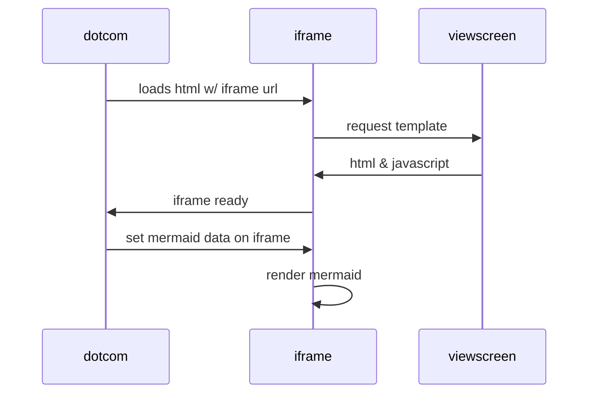
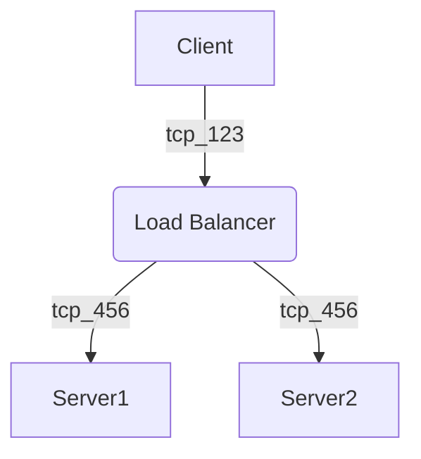

# gerrit-test-repo
This is gerrit repo

```mermaid
sequenceDiagram
    participant dotcom
    participant iframe
    participant viewscreen
    dotcom->>iframe: loads html w/ iframe url
    iframe->>viewscreen: request template
    viewscreen->>iframe: html & javascript
    iframe->>dotcom: iframe ready
    dotcom->>iframe: set mermaid data on iframe
    iframe->>iframe: render mermaid
```

```mermaid
            graph TD 
            A[Client] -->|tcp_123| B
            B(Load Balancer) 
            B -->|tcp_456| C[Server1] 
            B -->|tcp_456| D[Server2]
```
